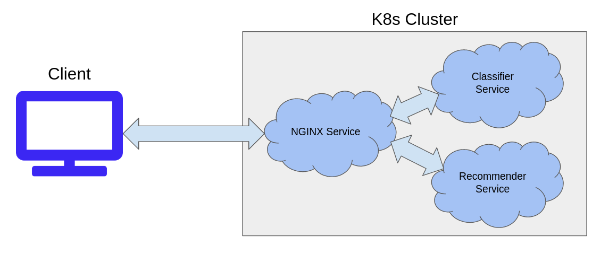

# chatbot

This repository contains the code for a movie chatbot web service deployed on AWS. The deployed chatbot can be found here: http://willsmoviechatbot.com/ 

The chatbot is deployed on a small Kubernetes cluster made up of three EC2 instances (one master, two workers). Currently, the cluster runs three services, each containing two pods. 

## System Design And Implementation

There are three services in the cluster: an NGINX service, a classifier service, and a recommender service. The NGINX service is exposed as type NodePort and an AWS Classic LoadBalancer is placed in front of the worker nodes. In a managed Kubernetes setting such as Amazon's EKS, the NGINX service would be exposed as type LoadBalancer, but achieving this configuration on bare EC2 instances is not straightforward. (I wanted to deploy on EC2 for the experience of installing k8s and interacting with the control plane directly.)

### NGINX Service
The NGINX service acts as a web server for the client and delivers the HTML and Javascript to the client upon visiting the web page. The light-weight component of the chatbot application is implemented in Javascript and runs client-side. When the chatbot needs to do sentiment analysis, movie lookup, or recommendation, the chatbot sends a POST request to the NGINX service. The NGINX service then acts as a reverse proxy (similar to an Ingress) for the classifier and recommender services.

### Classifier Service
The classifier service does sentiment analysis on movie reviews to determine whether the client liked the movie or not. The classifier uses a pretrained DistilBERT model fine-tuned on SST-2 and served with TorchServe. In order to satisfy compute requirements and improve latency, the model is quantized with minimal detriment to performance. In order to prevent movie titles from leaking into the sentiment analysis (e.g. "The Haunting" vs "Elf"), titles are masked with an <UNK> token. (It is unclear to me whether an <UNK> token is a better choice than a <PAD> token.) Additionally, the model could be further fine-tuned on a dataset of movie reviews, but the model's current performance is already very good for current requirements.

### Recommender Service
The recommender service does a spelling-insensitive movie title lookup and makes the final movie recommendations for the client. These two behaviors should be split into separate services and their combination into one module is a vestige from the original python implementation. (See future work below.) The lookup is done via substring matching for exact matches and Levenshtein distance for near matches on a dataset of movie titles. The recommendation algorithm is described next.
  
## Recommendation Algorithm
  
  Recommendations are done via genre-weighted item-item similarity between the Funk-MF matrix decomposition factors. The dataset we use is the MovieLens-latest-small dataset of 100,000 movie reviews from 600 users on 9,000 movies. Let R be the sparse 600x9000 utility matrix. We decompose the matrix R as follows:
  
  ### More details coming
  
  

## Future Work / Improvements
  Plans for future work and improvements are listed here.
  
  - Include unit testing and integration testing.
  - Separate the lookup and the recommendation abstractions into two separate services.
  - Improve k8s update stability due to tight compute space constraints, likely by assigning pods to specific nodes.
  - Implement the matrix decomposition on the full 25M movie review dataset via Spark.
  - Build a full MLOPS CI/CD pipeline from training to automatic deployment and model monitoring (Jenkins, AirFlow, etc).
  - Separate the movie database from the pods.
  
  ### Small fixes
  - Change pickled dictionaries to JSON for security reasons.
  - Chat greeting after reset is missing a space.
